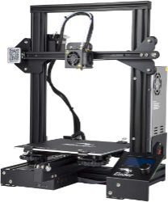
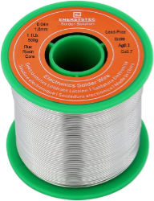

# 📦 Solder Sidekick™

Turn your Ender-3 3D printer into a **robotic soldering machine** for through-hole PCBs — powered by open-source software and hardware.

[](https://rinthlabs.com/products/solder-sidekick-notification-sign-up)

👉 [**This project is still being developed, sign up to be one of the first to know when it's released!**](https://rinthlabs.com/products/solder-sidekick-notification-sign-up)

---

## ⚡ What is Solder Sidekick™?

Solder Sidekick™ is an **open-source project** that converts a standard **Ender-3 3D printer** into an **automated through-hole soldering robot**.

It uses a **simple web interface** where you upload your **drill files** (from your Gerber PCB files), configure your component settings, and generate the **G-code** needed to precisely solder each pin.

[👉 Launch the Solder Sidekick™ Web App](https://rinthlabs.com/products/solder-sidekick-notification-sign-up)

- 🔥 Automates tedious manual soldering
- 🔥 Reduces human error
- 🔥 Great for small-run production and prototypes
- 🔥 Designed to be **affordable**, **modular**, and **extensible**

---

## 🛠 Why is Solder Sidekick™ valuable?

Soldering lots of **through-hole parts** by hand is time-consuming, tiring, and error-prone — especially for **small businesses**, **makers**, and **prototype builders**.  
Until now, solutions were either:
- Very expensive (industrial selective soldering machines) 💸
- Very DIY and unreliable 🛠️

**Solder Sidekick™** solves this by offering:
- An easy-to-assemble hardware kit
- An intuitive browser-based software tool
- Low-cost conversion based on an Ender-3 (a widely available 3D printer)

---

## 🏪 Get a Kit (Save Time and Hassle!)

While Solder Sidekick™ is open-source, sourcing the parts and machining the custom soldering iron tips can be difficult.

**Buying a full kit from our Shopify store** makes your life much easier:
- ✅ All hardware parts included (except Ender-3)
- ✅ Included custom machined soldering tips
- ✅ Semi-assembled kit saves you time
- ✅ Supports the project!

👉 [**Notification Sign Up for when it's released!**](https://rinthlabs.com/products/solder-sidekick-notification-sign-up)

---

## 🧪 Example PCB Breadboard

Want to test out the Solder Sidekick™ right away? We include a custom breadboard-style PCB in each kit as a sample project — great for demos and getting started.


This board is:
- Based on an open-source design by [Soldered Electronics](https://www.soldered.com/)
- Modified to include ["locking pin"](https://web.archive.org/web/20241003224515/https://www.sparkfun.com/tutorials/114) footprints for easier soldering
- Branded with the Solder Sidekick logo

You can find the gerber and drill files for the example [**PCB Breadboard**](./example/) in this repository.

📎 The breadboard PCB is licensed under the [TAPR Open Hardware License v1.0](https://tapr.org/the-tapr-open-hardware-license/), with all original and modified work credited and preserved.

👉 Learn more or browse the design files:
[PCB Breadboard](https://github.com/RinthLabs/PCB-breadboard-locking-pins-hardware-design)

---

## 🚀 Getting Started Guide

Ready to bring your Solder Sidekick™ to life?

Follow our step-by-step setup guide to:

1. 🧩 **Assemble your kit**
2. 🧾 **Prepare your PCB drill files**
3. 🧠 **Generate G-code using the web app**
4. ❓ **Browse FAQs and troubleshooting tips**

👉 [**Start Here: Solder Sidekick Setup & Guide**](https://www.soldersidekick.com/getting-started)

Whether you're soldering your first board or tuning your workflow, this page has everything you need to hit the ground running.

---

## 🧰 Recommended Gear
To get the most out of your Solder Sidekick™, we recommend picking up the following essentials:

🖨️ Compatible Printer
Solder Sidekick is designed specifically for the Ender-3 3D printer. Other printers may require custom modifications.

[
<br>👉 Buy on Amazon](https://amzn.to/43fXs6A)

---

🧵 Recommended Solder
We suggest using 1.0mm solder for optimal feed performance and joint coverage.

[
<br>👉 Buy on Amazon](https://amzn.to/43n6xuv)

---

Note: These are Amazon affiliate links. If you make a purchase, a small portion helps fund the development of the Solder Sidekick™ project — at no extra cost to you. ❤️

---

## 💖 Support the Project

This project is **community-driven** and **open-source**!

- 🌟 [Sponsor Solder Sidekick™ on GitHub](https://github.com/BenRinthLabs) to help fund development
- 🔧 Contribute code, documentation, or testing
- 📣 Spread the word!

---


## 🖥 How to Run the Web Interface Locally

If you want to **develop** or **run the web interface locally**:

1. Clone this repo:
   ```bash
   git clone https://github.com/RinthLabs/SolderSidekick.git
   ```

2. Install dependencies:
   ```bash
   npm install
   ```

3. Start the development server:
   ```bash
   npm run dev
   ```

4. Open your browser at:
   ```
   http://localhost:5173/
   ```

> 📢 Pull requests are welcome! Feel free to open an issue or contribute a new feature!

---

# 🚀 Quick Links

- 🏪 [Buy a Solder Sidekick Kit](https://rinthlabs.com/products/solder-sidekick-notification-sign-up)
- 💬 [Sponsor Solder Sidekick on GitHub](https://github.com/sponsors/BenRinthLabs)
- 📖 [Documentation (coming soon)](#)

---

# 🛠 License

This project is licensed under the **MIT License** — free to use, modify, and share!

---

# 🎉 Thank you for supporting open-source hardware!